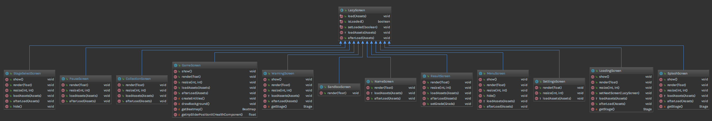
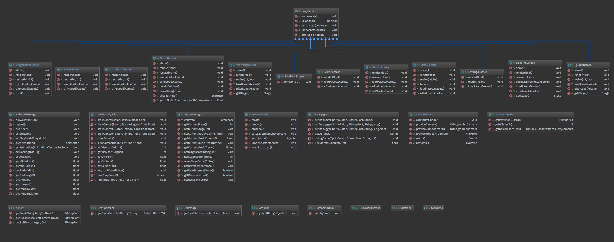
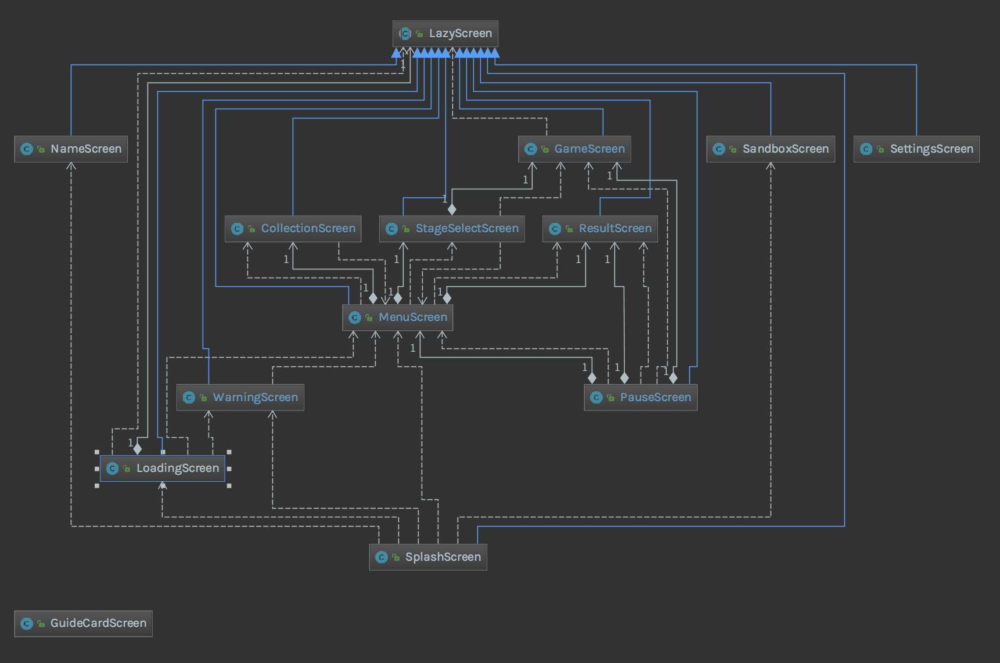

# ตารางการสืบทอดของคลาส

## การสืบทอดของหน้า Screen ทั่วไป

<p align="center">กราฟแสดงการสืบทอดของหน้า Screen ทั่วไป</p>

จะเห็นได้ว่า หน้า Lazy Screen ที่มีหน้าที่เป็น Abstract Class นั้นสืบทอดมาให้กับ Screen ทุกตัว<br>
และ Lazy Screen นั้นก็สืบทอดมาจาก Screen Adapter ที่เป็น Class ที่เป็นของ Library Screen Adapter<br>
และ Screen Adater นั้นก็สืบทอดมาจากอินเตอร์เฟส Screen<br>
ซึ่งอินเตอร์เฟส Screen นั้น เป็นส่วนหนึ่งของแพ็กเกจ ของ com.badlogic.gdx ซึ่งก็คือ Library ของ LibGDX

โดย Interface Screen จะมี Method หลักๆอยู่ 7 Method นั่นคือ

```java
public interface Screen {
    public void show ();
    public void render (float delta);
    public void resize (int width, int height);
    public void pause ();
    public void resume ();
    public void hide ();
    public void dispose ();
}
```

ซึ่งมีหน้าที่การทำงานที่แตกต่างกัน และการทำงานที่แตกต่างกันอีกด้วย


<p align="center">กราฟแสดงการสืบทอดของหน้า Screen และ Class หลักที่เกี่ยวข้อง</p>


<p align="center">กราฟแสดงการสืบทอด Class และการเรียก Method ของหน้า UI เกม (Screen)</p>


กราฟแสดงการสืบทอดของ Utility


กราฟแสดงการสืบทอดของตัวเกมหลัก
